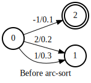
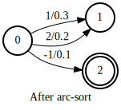
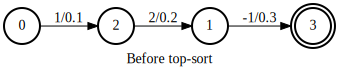
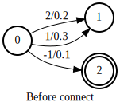
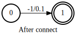

Arc map
=======

Arc map is an implementation detail and is not visible
to users. It is however crucial to make autograd work
and to propagate attributes correctly.

This tutorial tries to give answers to the following questions:

- What is an arc map?
- What is the relationship between autograd and arc map?
- How are attributes propagated with the help of arc map?

What is an arc map?
~~~~~~~~~~~~~~~~~~~

arc_sort
^^^^^^^^

Before explaining what an arc map is, let us first see an example
of :func:`k2.arc_sort`.

.. literalinclude:: ./code/arc_map/arc_sort.py
  :caption: :func:`k2.arc_sort` example
  :language: python
  :lines: 1-

.. _arc-map-before-arc-sorted:
.. table:: Arc indexes of the arc-unsorted Fsa
    :align: center

    +-----------+-----------+------------+-------+-------+
    | arc index | src_state | dest_state | label | score |
    +-----------+-----------+------------+-------+-------+
    |   arc_0   |     0     |      2     |  -1   | 0.1   |
    +-----------+-----------+------------+-------+-------+
    |   arc_1   |     0     |      1     |   2   | 0.2   |
    +-----------+-----------+------------+-------+-------+
    |   arc_2   |     0     |      1     |   1   | 0.3   |
    +-----------+-----------+------------+-------+-------+

.. _arc-map-after-arc-sorted:
.. table:: Arc indexes of the arc-sorted Fsa
    :align: center

    +-----------+-----------+------------+-------+-------+
    | arc index | src_state | dest_state | label | score |
    +-----------+-----------+------------+-------+-------+
    |   arc_0   |     0     |      1     |   1   | 0.3   |
    +-----------+-----------+------------+-------+-------+
    |   arc_1   |     0     |      1     |   2   | 0.2   |
    +-----------+-----------+------------+-------+-------+
    |   arc_2   |     0     |      2     |  -1   | 0.1   |
    +-----------+-----------+------------+-------+-------+

Table :ref:`arc-map-before-arc-sorted` and Table :ref:`arc-map-after-arc-sorted`
show the arc indexes of an Fsa before and after applying :func:`k2.arc_sort`.
The corresponding arc map is shown in the following table.

.. table:: An arc map of an operation specifies for each arc in the output Fsa what the corresponding arc in the input Fsa is
    :align: center

    +-------------+----------------+------------------+
    |             | arc_sorted_fsa | arc_unsorted_fsa |
    +-------------+----------------+------------------+
    | Arc indexes |      arc_0     |       arc_2      |
    |             +----------------+------------------+
    |             |      arc_1     |       arc_1      |
    |             +----------------+------------------+
    |             |      arc_2     |       arc_0      |
    +-------------+----------------+------------------+

In the above example, the ``arc_map`` is a 1-D `torch.Tensor`::

  tensor([2, 1, 0], dtype=torch.int32)

- ``arc_map[0] == 2`` means arc_0 of the output Fsa corresponds to arc_2 of the input Fsa
- ``arc_map[1] == 1`` means arc_1 of the output Fsa corresponds to arc_1 of the input Fsa
- ``arc_map[2] == 0`` means arc_2 of the output Fsa corresponds to arc_0 of the input Fsa

top_sort
^^^^^^^^

The arc map for :func:`k2.arc_sort` is a one-to-one map. That is, for each arc
in the output Fsa, we can find its corresponding arc in the input Fsa, and vice versa.
Another function that also has a one-to-one arc map is :func:`k2.top_sort`. An example
is given below.

.. literalinclude:: ./code/arc_map/top_sort.py
  :caption: :func:`k2.top_sort` example
  :language: python
  :lines: 1-

.. table:: Arc indexes of the top-unsorted Fsa
    :align: center

    +-----------+-----------+------------+-------+-------+
    | arc index | src_state | dest_state | label | score |
    +-----------+-----------+------------+-------+-------+
    |   arc_0   |     0     |      2     |   1   | 0.1   |
    +-----------+-----------+------------+-------+-------+
    |   arc_1   |     1     |      3     |  -1   | 0.3   |
    +-----------+-----------+------------+-------+-------+
    |   arc_2   |     2     |      1     |   2   | 0.2   |
    +-----------+-----------+------------+-------+-------+

.. table:: Arc indexes of the top-sorted Fsa
    :align: center

    +-----------+-----------+------------+-------+-------+
    | arc index | src_state | dest_state | label | score |
    +-----------+-----------+------------+-------+-------+
    |   arc_0   |     0     |      1     |   1   | 0.1   |
    +-----------+-----------+------------+-------+-------+
    |   arc_1   |     1     |      2     |   2   | 0.2   |
    +-----------+-----------+------------+-------+-------+
    |   arc_2   |     2     |      3     |  -1   | 0.3   |
    +-----------+-----------+------------+-------+-------+

.. table::
    :align: center

    +-------------+----------------+------------------+
    |             | top_sorted_fsa | top_unsorted_fsa |
    +-------------+----------------+------------------+
    | Arc indexes |      arc_0     |       arc_0      |
    |             +----------------+------------------+
    |             |      arc_1     |       arc_2      |
    |             +----------------+------------------+
    |             |      arc_2     |       arc_1      |
    +-------------+----------------+------------------+

The above ``arc_map`` is a 1-D `torch.Tensor`::

  tensor([0, 2, 1], dtype=torch.int32)

- ``arc_map[0] == 0`` means arc_0 of the output Fsa corresponds to arc_0 of the input Fsa
- ``arc_map[1] == 2`` means arc_1 of the output Fsa corresponds to arc_2 of the input Fsa
- ``arc_map[2] == 1`` means arc_2 of the output Fsa corresponds to arc_1 of the input Fsa

connect
^^^^^^^

Some operations reduce the number of arcs, i.e., not every arc in the input Fsa
is kept in the output Fsa. One such operation is :func:`k2.connect`. An example
is given below.

.. literalinclude:: ./code/arc_map/connect.py
  :caption: :func:`k2.connect` example
  :language: python
  :lines: 1-

.. table:: Arc indexes of the unconnected Fsa
    :align: center

    +-----------+-----------+------------+-------+-------+
    | arc index | src_state | dest_state | label | score |
    +-----------+-----------+------------+-------+-------+
    |   arc_0   |     0     |      1     |   2   | 0.2   |
    +-----------+-----------+------------+-------+-------+
    |   arc_1   |     0     |      2     |  -1   | 0.1   |
    +-----------+-----------+------------+-------+-------+
    |   arc_2   |     0     |      1     |   1   | 0.3   |
    +-----------+-----------+------------+-------+-------+

.. table:: Arc indexes of the connected Fsa
    :align: center

    +-----------+-----------+------------+-------+-------+
    | arc index | src_state | dest_state | label | score |
    +-----------+-----------+------------+-------+-------+
    |   arc_0   |     0     |      1     |  -1   | 0.1   |
    +-----------+-----------+------------+-------+-------+

.. table::
    :align: center

    +-------------+---------------+-----------------+
    |             | connected_fsa | unconnected_fsa |
    +-------------+---------------+-----------------+
    | Arc indexes |     arc_0     |      arc_1      |
    +-------------+---------------+-----------------+

Its ``arc_map`` is::

  tensor([1], dtype=torch.int32)

- ``arc_map[0] == 1`` means arc_0 of the output Fsa corresponds to arc_1 of the input Fsa
- Note that the resulting ``arc_map`` contains only one entry

add_epsilon_self_loops
^^^^^^^^^^^^^^^^^^^^^^

Some operations increase the number of arcs, i.e., the output Fsa has more
arcs than that of the input Fsa. One such example is :func:`k2.add_epsilon_self_loops`.
